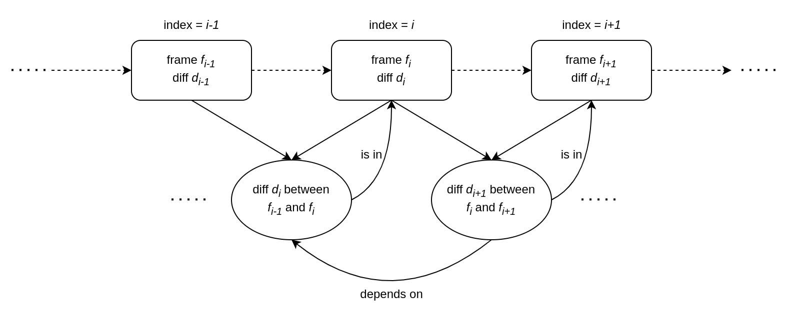

# protocol

This file defines the protocol that is being used to exchange messages between the two endpoints.

## Overview

Scrtp uses a client-server model. The computer which sends its own screen frames and replicates user input represents the server, while external computers which receive the screen frames and send peripheral signals (like a mouse click or a key press on the keyboard) act as clients.

## Steps

At any moment, if the window size changes in the server, the server must send the updated size to the client using the appropriate message before sending the next window frame data.

The diagram below has a graphical representation of the entire connection process.

[TODO update image]


## Features

### Connection-less connection

The Scrtp protocol is built on top of UDP. This choice brings several advantages, such as reduced network throughput (and consequent increased speed) and reduced protocol complexity while providing checksums. However, UDP lacks some features such as:

 - connection orientation ("is the other endpoint still online and ready to communicate with me?")
 - packet acknowledgements ("has the other endpoint received my packet?")
 - packet ordering ("has the other endpoint received my packets in order?")

The Scrtp protocol incorporates well these features without bringing all the TCP complexity with them; actually, without complexity at all.

A special type of packet (`keepal`, see [Keys](#keys)) solves the lack of connection orientation by providing a keep-alive-like mechanism. An ACK flag in each packet (see [Flags](#flags)), together with the `ack` packet (see [Keys](#keys)), solves the lack of packet acknowledgement. A specialized field (`idx`, see [Structure of packets](#structure-of-packets)) in each packet solves the lack of packet ordering.

### Security

All the payloads between the two endpoints are encrypted using [RSA](https://en.wikipedia.org/wiki/RSA_(cryptosystem)). Make sure to have a pair of public and private keys.

This protocol does not provide a key exchange mechanism. The user is supposed to manually copy the server's public key into the client PC in a (presumably) secure way.

### Compression

Scrtp can send a lot of images during short periods of time, especially during the frame update phase (see [Steps](#steps)). However, doing so without compression generates a very high throughput which may not even fit some of today's network bandwidths. For example, if we wanted to send a 1080p RGB video at 30fps, it would require

```
width = 1920 pixels
height = 1080 pixels
color channels = 3 bytes (8 bit depth)
frames per second = 30

1920 * 1080 * 3 * 30 = 186,624,000 bytes per second ~= 177.9 MiB/s ~= 1493 Mbps
```

In order to mitigate this issue, the protocol takes advantage of both lossy compression and a binary [diff algorithm](https://en.wikipedia.org/wiki/Data_differencing).

First, a lossy compression is applied to the image using [DCT](https://en.wikipedia.org/wiki/Discrete_cosine_transform). Then, a binary diff algorithm compares the previous image with the current one. The output of the diff algorithm is used as content of the packet. Some frames may be sent without passing through the diff algorithm (*DCT-only* seems like a good adjective for them); see below.

The first frame must be sent in the DCT-only way.

#### Resilience to packet loss

If you are alert enough you may have noticed one flaw that involves packet loss. Consider the following:

 - a *diff output* is an alias for the output of a diff algorithm applied to two frames
 - each diff output is only valid between two *consecutive* frames
 - many consecutive diff outputs make a *diff chain*; that is, given three consecutive diffs *d1*, *d2*, and *d3*, then *d3* depends on *d2* which depends on *d1*, so *d3* depends indirectly on *d1*
 - the frame packets do not require an acknowledgement
 - if a diff output gets lost for any possible reason, none of the two endpoints will know it and all the following diff outputs are not going to produce the desired outcome because the diff chain breaks



To sum up, in order to provide a reliable video transmission, it is necessary to periodically send some DCT-only frames, without calculating diffs. The endpoint that receives the compressed frames does not need to know ahead of time when the DCT-only packet will occur, as a parameter at the beginning of packet's value indicates it exactly for the current frame.

If the first frame does not arrive due to a packet loss, the client waits until the next DCT-only frame.

### Concurrency

A sequential approach would be ideal if the window did not update (unless on user input) and had no animations. In a modern world, it is not conceivable to use a sequential approach hoping that the final user will not need window updates in-between input signals.

To deal with this issue, Scrtp takes advantage of concurrency. The frames sent by the server are concurrently independent of the input signals sent by the client, as if they were sent in two different channels.

## Structure of packets

The packets have the following structure:

```
0       1     3   5   7    n+7    n+m+7   <- offset in bytes
+-------+-----+---+---+-----+-------+
| flags | idx | n | m | key | value |     <- field names
+-------+-----+---+---+-----+-------+
```

where:

 - `flags` is a byte in which every bit is a flag
 - `idx` is the packet index (starting from 0)
 - `key` is a string for the key
 - `value` is the value associated with the key
 - `n` is the length of the key in bytes
 - `m` is the length of the value in bytes

The packet fields must comply with these rules:

 - The [endianness](https://en.wikipedia.org/wiki/Endianness) of the binary-encoded fields (such as `idx`, `n`, and `m`) must follow the [network byte order](https://en.wikipedia.org/wiki/Endianness#Networking) (big-endian). If `value` is made of one or more multi-byte binary values, those also follow the network endianness.
 - The data type of the `value` field depends on the `key` value.
 - The `key` field (and the `value` field, if it is a string) must not end with a null terminator character.
 - the `key` field must only contain printable characters

### Behaviour with invalid packets

A packet is defined invalid whenever its content is not consistent. Some typical examples are:

 - the sum of `n + m + 7` is not equal to the UDP payload length
 - the value of `n` is greater than the longest known `key` field length
 - the `key` field does not match any known `key`
 - the `key` field contains control characters such as the null terminator or a line break
 - the unused flags, if any, are set to 1 rather than 0 (see [Flags](#flags))
 - the `value` field is not as long as expected

If a packet does not pass validity checks, it is discarded; that is, the endpoint ignores it and acts as if that packet never arrived. Discarding packets does not cause any harm to the connection, as the packets perceived as important use the acknowledgement flag.

Validity checks *do not* check whether or not the packet fields have the expected contents, but rather if the overall packet structure follows the rules decided upon.

### Flags

As a reference, the representation below describes the bit positions in the `flags` field.

```
0                               1  <- offset in bytes
+---+---+---+---+---+---+---+---+
| 1 | 2 | 3 | 4 | 5 | 6 | 7 | 8 |  <- bit indexes
+---+---+---+---+---+---+---+---+
```

<table>
   <tr>
      <th> position </th>
      <th> name </th>
      <th> meaning </th>
   </tr>
   <tr>
      <td> 1 </td>
      <td> (unnamed) </td>
      <td> (unused) </td>
   </tr>
   <tr>
      <td> 2 </td>
      <td> (unnamed) </td>
      <td> (unused) </td>
   </tr>
   <tr>
      <td> 3 </td>
      <td> (unnamed) </td>
      <td> (unused) </td>
   </tr>
   <tr>
      <td> 4 </td>
      <td> (unnamed) </td>
      <td> (unused) </td>
   </tr>
   <tr>
      <td> 5 </td>
      <td> (unnamed) </td>
      <td> (unused) </td>
   </tr>
   <tr>
      <td> 6 </td>
      <td> (unnamed) </td>
      <td> (unused) </td>
   </tr>
   <tr>
      <td> 7 </td>
      <td> (unnamed) </td>
      <td> (unused) </td>
   </tr>
   <tr>
      <td> 8 </td>
      <td> ACK </td>
      <td> acknowledgement required (1 = yes, 0 = no) </td>
   </tr>
</table>

#### Acknowledgement

If the sender requires an acknowledgement, the receiver must send a packet in which:

 - the acknowledgement flag is set to 0
 - the key is `ack`
 - the value is made of the key and the index of the packet to acknowledge, separated by a space character.

[TODO how much time should pass before sending again the packet that requires an acknowledgement?]


### Index

[TODO]

### Keys

All the strings use the [UTF-8](https://en.wikipedia.org/wiki/UTF-8) encoding.

<table>
   <tr>
      <th> name </th>
      <th> data type </th>
      <th> requires ack </th>
      <th> description </th>
   </tr>
   <tr>
      <td> hshake </td>
      <td> string </td>
      <td> yes </td>
      <td> the handshake (client's public key + protocol version as text, separated by a space) </td>
   </tr>
   <tr>
      <td> ack </td>
      <td> string </td>
      <td> no </td>
      <td> the acknowledgement of the previous packet (see <a href="#acknowledgement">Acknowledgement</a>) </td>
   </tr>
   <tr>
      <td> abort </td>
      <td> string </td>
      <td> yes </td>
      <td> report an error to the other endpoint with a message explaining what went wrong and close the connection </td>
   </tr>
   <tr>
      <td> wins </td>
      <td> string </td>
      <td> yes </td>
      <td> the server's available windows, the window names are separated by newlines </td>
   </tr>
   <tr>
      <td> winid </td>
      <td> 32-bit unsigned integer </td>
      <td> yes </td>
      <td> the window ID chosen by the client, 0 for the whole desktop </td>
   </tr>
   <tr>
      <td> winsize </td>
      <td> array of 2 16-bit unsigned integers </td>
      <td> yes </td>
      <td>
         the window size represented as 2 integers of 16 bits:
         <ul>
            <li> the first for the window width </li>
            <li> the second for the window height </li>
         </ul>
      </td>
   </tr>
   <tr>
      <td> pref </td>
      <td> [TODO] </td>
      <td> yes </td>
      <td>
         <ul>
            <li> 1 unsigned 8-bit integer for the quality of the server's frames, from 1 (lowest) to 5 (highest) </li>
            <li> [TODO] </li>
         </ul>
      </td>
   </tr>
   <tr>
      <td> frame </td>
      <td> 1 byte followed by an array of bytes (variable size) </td>
      <td> no </td>
      <td>
         a compressed window frame; the first byte can either be:
         <ul>
            <li> the value of the 't' character in UTF-8 (0x74) for a DCT-only compression </li>
            <li> the value of the 'f' character in UTF-8 (0x66) for a DCT + diff compression </li>
         </ul>
         while the rest of the bytes contain the compressed image data <br/>
         <br/>
         the first packet of this kind must be compressed in the DCT-only way <br/>
         <br/>
         see <a href="#compression">Compression</a> for more details
      </td>
   </tr>
   <tr>
      <td> kbdev </td>
      <td> array of 2 8-bit unsigned integers </td>
      <td> no </td>
      <td>
         a keyboard input event represented as 2 integers of 8 bits:
         <ul>
            <li> the first for the state of the key (1 for "pressed" and 0 for "released") </li>
            <li> the second for the key code </li>
         </ul>
      </td>
   </tr>
   <tr>
      <td> msclk </td>
      <td> array of 2 8-bit unsigned integers </td>
      <td> no </td>
      <td>
         a mouse click event represented as 2 integers of 8 bits:
         <ul>
            <li> the first for the state of the button (1 for "pressed" and 0 for "released") </li>
            <li> the second for the button code (0 for "left", 1 for "right" and 2 for "middle") </li>
         </ul>
      </td>
   </tr>
   <tr>
      <td> msmv </td>
      <td> array of 2 16-bit unsigned integers </td>
      <td> no </td>
      <td>
         a mouse move event represented as 2 integers of 16 bits:
         <ul>
            <li> the first for the new mouse position on the X-axis </li>
            <li> the second for the new mouse position on the Y-axis </li>
         </ul>
      </td>
   </tr>
   <tr>
      <td> msscr </td>
      <td> array of 2 doubles </td>
      <td> no </td>
      <td>
         a mouse scroll event represented as 2 doubles:
         <ul>
            <li> the first for the scroll offset on the X-axis </li>
            <li> the second for the scroll offset on the Y-axis </li>
         </ul>
      </td>
   </tr>
   <tr>
      <td> keepal </td>
      <td> 8-bit unsigned integer </td>
      <td> yes </td>
      <td>
         keep the connection alive for the time specified in the value (in seconds) and expect another keep-alive packet during that time
      </td>
   </tr>
</table>
