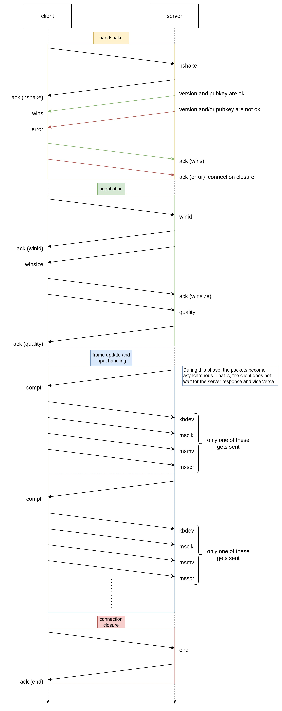

# protocol

This file defines the protocol that is being used to exchange messages between
the two endpoints.

## Overview

Scrtp uses a client-server model. The computer which sends its own screen
frames and replicates user input represents the server, while external
computers which receive the screen frames and send peripheral signals (like a
mouse click or a key press on the keyboard) act as clients.

## Steps

Keep in mind that, whenever a fatal error occurs on either side, the side where
the error occurred must send an `error` packet with a brief description of what
happened.

At any moment, if the window size changes in the server, the server must send
the updated size to the client using the appropriate message before sending the
next window frame data.

The diagram below has a graphical representation of the entire connection
process.



## Concurrency

A sequential approach would be ideal if the window did not update (unless on
user input) and had no animations. In a modern world, it is not conceivable to
use a sequential approach hoping that the final user will not need window
updates in-between input signals.

To deal with this issue, Scrtp takes advantage of concurrency. The frames sent
by the server are concurrently independent of the input signals sent by the
client, as if they were sent in two different channels.

```
frames:         S->->->->->->-C
input signals:  S-<-<-<-<-<-<-C
```

## Authentication and encryption

All the packets between the two endpoints are encripted using
[TLS](https://en.wikipedia.org/wiki/Transport_Layer_Security). Make sure to
have a certificate in your server.

## Compression

[TODO]

## Structure of packets

All packets use UDP for both ease of use and speed.

The packets have the following structure:

```
0       1     3   5    n+5 n+7    n+m+7 (bytes)
+-------+-----+---+-----+---+-------+
| flags | idx | n | key | m | value |
+-------+-----+---+-----+---+-------+
```

where:

 - `flags` is a byte in which every bit is a flag
 - `idx` is the packet index (starting from 0)
 - `key` is a string representing the meaning of the value
 - `n` is the length of the key in bytes
 - `value` is the value associated with the key
 - `m` is the length of the value in bytes

The data type of the `value` field depends on the `key` value.

The `key` field (and the `value` field, if it is a string) must be
null-terminated. The respective length fields (`n` and `m`) must also consider
the null-terminator in the bytes count.

## Flags

As a reference, the representation below describes the bit positions in the
`flags` field.

```
+---+---+---+---+---+---+---+---+
| 1 | 2 | 3 | 4 | 5 | 6 | 7 | 8 |
+---+---+---+---+---+---+---+---+
```

<table>
   <tr>
      <th> position </th>
      <th> meaning </th>
   </tr>
   <tr>
      <td> 1 </td>
      <td> (unused) </td>
   </tr>
   <tr>
      <td> 2 </td>
      <td> (unused) </td>
   </tr>
   <tr>
      <td> 3 </td>
      <td> (unused) </td>
   </tr>
   <tr>
      <td> 4 </td>
      <td> (unused) </td>
   </tr>
   <tr>
      <td> 5 </td>
      <td> (unused) </td>
   </tr>
   <tr>
      <td> 6 </td>
      <td> (unused) </td>
   </tr>
   <tr>
      <td> 7 </td>
      <td> (unused) </td>
   </tr>
   <tr>
      <td> 8 </td>
      <td>
         acknowledgement required (1 = yes, 0 = no)
      </td>
   </tr>
</table>

### Acknowledgement

If the acknowledgement is required, the receiver must send a packet in which:

 - the acknowledgement flag is set to 0
 - the key is `ack`
 - the value is made of the key and the index of the packet to acknowledge,
   separated by a space character.

## Keys

All the strings use the [UTF-8](https://en.wikipedia.org/wiki/UTF-8) encoding.

<table>
   <tr>
      <th> name </th>
      <th> data type </th>
      <th> requires ack </th>
      <th> description </th>
   </tr>
   <tr>
      <td> version </td>
      <td> string </td>
      <td> yes </td>
      <td> the protocol version used by the client </td>
   </tr>
   <tr>
      <td> ack </td>
      <td> string </td>
      <td> no </td>
      <td>
         the acknowledgement of the previous packet (see
         <a href="#acknowledgement">Acknowledgement</a>)
      </td>
   </tr>
   <tr>
      <td> error </td>
      <td> string </td>
      <td> yes </td>
      <td> an error message explaining what went wrong </td>
   </tr>
   <tr>
      <td> wins </td>
      <td> string </td>
      <td> yes </td>
      <td>
         the server's available windows, the window names are separated by
         newlines
      </td>
   </tr>
   <tr>
      <td> winid </td>
      <td> integer </td>
      <td> yes </td>
      <td> the window ID chosen by the client, 0 for the whole desktop </td>
   </tr>
   <tr>
      <td> winsize </td>
      <td> array of 2 integers </td>
      <td> yes </td>
      <td>
         the window size represented as 2 integers of 16 bits:
         <ul>
            <li> the first for the window width </li>
            <li> the second for the window height </li>
         </ul>
      </td>
   </tr>
   <tr>
      <td> quality </td>
      <td> integer </td>
      <td> yes </td>
      <td>
         the quality of the server's frames, from 1 (lowest) to 5 (highest)
      </td>
   </tr>
   <tr>
      <td> frame </td>
      <td> array of bytes (variable size) </td>
      <td> no </td>
      <td> the compressed window frame </td>
   </tr>
   <tr>
      <td> kbdev </td>
      <td> array of 2 integers </td>
      <td> no </td>
      <td>
         a keyboard input event represented as 2 integers of 8 bits:
         <ul>
            <li>
               the first for the state of the key (1 for "pressed" and 0 for
               "released")
            </li>
            <li> the second for the key code </li>
         </ul>
      </td>
   </tr>
   <tr>
      <td> msclk </td>
      <td> array of 2 integers </td>
      <td> no </td>
      <td>
         a mouse click event represented as 2 integers of 8 bits:
         <ul>
            <li>
               the first for the state of the button (1 for "pressed" and 0 for
               "released")
            </li>
            <li>
               the second for the button code (0 for "left", 1 for "right" and 2
               for "middle")
            </li>
         </ul>
      </td>
   </tr>
   <tr>
      <td> msmv </td>
      <td> array of 2 integers </td>
      <td> no </td>
      <td>
         a mouse move event represented as 2 integers of 16 bits:
         <ul>
            <li> the first for the new mouse position on the X-axis </li>
            <li> the second for the new mouse position on the Y-axis </li>
         </ul>
      </td>
   </tr>
   <tr>
      <td> msscr </td>
      <td> array of 2 doubles </td>
      <td> no </td>
      <td>
         a mouse scroll event represented as 2 doubles:
         <ul>
            <li> the first for the scroll offset on the X-axis </li>
            <li> the second for the scroll offset on the Y-axis </li>
         </ul>
      </td>
   </tr>
   <tr>
      <td> end </td>
      <td> boolean </td>
      <td> yes </td>
      <td> a request to end connection </td>
   </tr>
</table>
